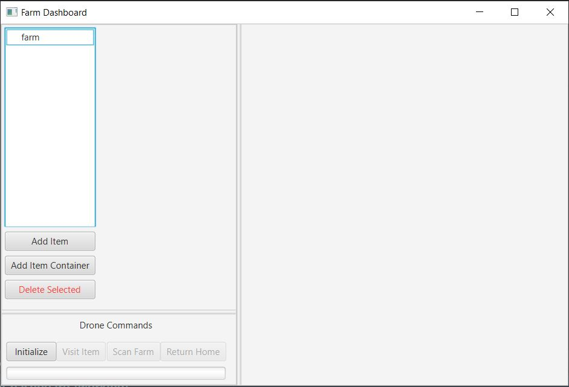

# Farm Dashboard

## Description
Welcome to farm dashboard. An agricultural software application created by five UAB students. 
Farm dashboard's goal is to help increase the productivity of large-scale farmers by automating 
several manual functions performed by them, such as using drones with automated flight paths for 
monitoring.

In farm dash board, you can add items and item containers to the farm tree structure 
to create a virtual model of your farm. You can rename items and item containers to match what 
they represent on your farm. You can initialize a drone and a drone command center that can scan 
items individually or scan the whole farm.  

## Screenshots

## Contact Us
[Elijah Sink](mailto:ejsink@uab.edu)  
[Jessie Elkins](mailto:jelkins3@uab.edu)  
[Dawson Sargent](mailto:dsar9901@uab.edu)  
[Logan Creel](mailto:loganrc@uab.edu)  
[Kelvin Yi](mailto:kyi@uab.edu)
